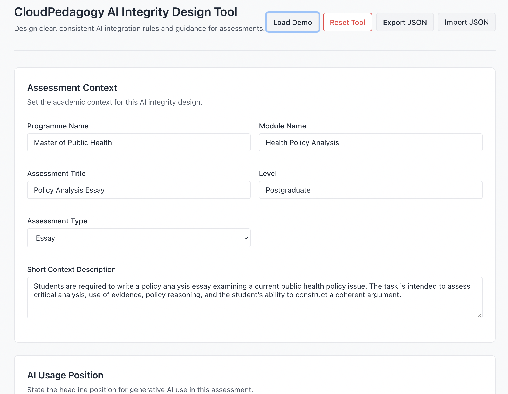

# AI Integrity Design Tool

A local-first tool for designing clear, structured, and governance-ready approaches to acceptable AI use in assessment.

🌐 **Live Hosted Version**  
http://cloudpedagogy-ai-integrity-design-tool.s3-website.eu-west-2.amazonaws.com/

🖼️ **Screenshot**  

---

## 🔗 Role in the CloudPedagogy Ecosystem

**Phase:** Phase 4 — Assessment & Integrity Layer  

**Role:**  
Supports the design of AI-aware academic integrity approaches by defining acceptable use, conditions, risks, and guidance for both students and staff.

**Upstream Inputs:**  
- Assessment structures from the Assessment Design Engine  
- Institutional policy context (optional)

**Downstream Outputs:**  
- Structured guidance for the Evidence & QA Pack Generator  
- Inputs for Curriculum Change Manager (tracking policy evolution)

**Does NOT:**  
- Detect or police misconduct  
- Replace institutional policy frameworks  
- Automatically generate compliance decisions  

---

## Overview

The **AI Integrity Design Tool** supports a shift from reactive enforcement to **integrity-by-design**.

It enables educators and programme teams to:
- Define acceptable, unacceptable, and conditional AI use  
- Generate clear student-facing guidance  
- Document staff rationale and authenticity expectations  
- Identify risks and assumptions in AI-enabled assessment  

This helps create assessment environments that are:
- transparent  
- consistent  
- pedagogically aligned  
- governance-aware  

---

## Key Features

- **AI Usage Positioning**  
  Define whether AI use is allowed, restricted, or conditional  

- **Structured Use Definitions**  
  Specify acceptable and unacceptable uses  

- **Conditions & Constraints**  
  Capture boundaries for appropriate AI use  

- **Guidance Generation**  
  Produce student-facing guidance and staff rationale  

- **Risk & Authenticity Design**  
  Identify risks and authenticity considerations  

---

## Technical Overview

- Built with TypeScript + Vite (React)  
- Fully local-first — runs entirely in the browser  
- Uses localStorage for persistence  
- Supports JSON import/export  
- No backend or external data storage  

---

## Run Locally

npm install  
npm run dev  

---

## Build

npm run build  

---

## Design Principles

- Local-first and inspectable  
- Governance-aware by design  
- Structured, not automated decision-making  
- Supports human judgement rather than replacing it  

---

## Disclaimer

This repository contains exploratory, framework-aligned tools developed for reflection, learning, and discussion.

These tools are provided as-is and are not production systems, audits, or compliance instruments. Outputs are indicative only and should be interpreted using professional judgement.

- All applications run locally in the browser  
- No user data is collected, stored, or transmitted  
- All example data is synthetic and does not represent real institutions or programmes  

---

## About CloudPedagogy

CloudPedagogy develops open, governance-credible tools for building confident, responsible AI capability across education, research, and public service.

- Website: https://www.cloudpedagogy.com/  
- Framework: https://github.com/cloudpedagogy/cloudpedagogy-ai-capability-framework  
